# 🚀 AWS Lambda + API Gateway

## 📌 Project Overview

This project demonstrates how to build and deploy a serverless REST API using AWS Lambda and Amazon API Gateway. The project covers Lambda function creation, API Gateway configuration, resource and method creation, deployment stages, API documentation, and OpenAPI export.

The objective of this project was to understand serverless computing, API management, API documentation, and cloud-based application integration using AWS services.

---

## ✅ Project Status

Completed Successfully

---

## 🎯 Objectives

* Create an AWS Lambda Function
* Configure Amazon API Gateway
* Create API Resources
* Configure GET Method
* Deploy API to a Stage
* Generate API Documentation
* Export API Definition (OpenAPI)
* Understand Serverless Architecture

---

## 🛠️ Services Used

### AWS Services

* AWS Lambda
* Amazon API Gateway

### Tools

* AWS Management Console
* Visual Studio Code
* GitHub

---

## 🌐 Serverless Architecture

```text
Client
   │
   ▼
API Gateway
   │
   ▼
Lambda Function
   │
   ▼
Response
```

---

## ✨ Features

* Serverless API Deployment
* REST API Configuration
* GET Method Integration
* API Stage Deployment
* API Documentation
* OpenAPI Export
* Cloud-Based API Management

---

## 🚀 Implementation Steps

1. Selected AWS Region
2. Created Lambda Function
3. Added Lambda Code
4. Created API Gateway REST API
5. Created API Resource
6. Created GET Method
7. Generated API Endpoint URL
8. Deployed API to Stage
9. Tested API Endpoint
10. Resolved Missing Authentication Token Error
11. Created Documentation Part
12. Published Documentation
13. Exported API Definition
14. Downloaded OpenAPI ZIP File
15. Completed Project
16. Deleted AWS Resources

---

# 📸 Screenshots

## 1. Region Selected

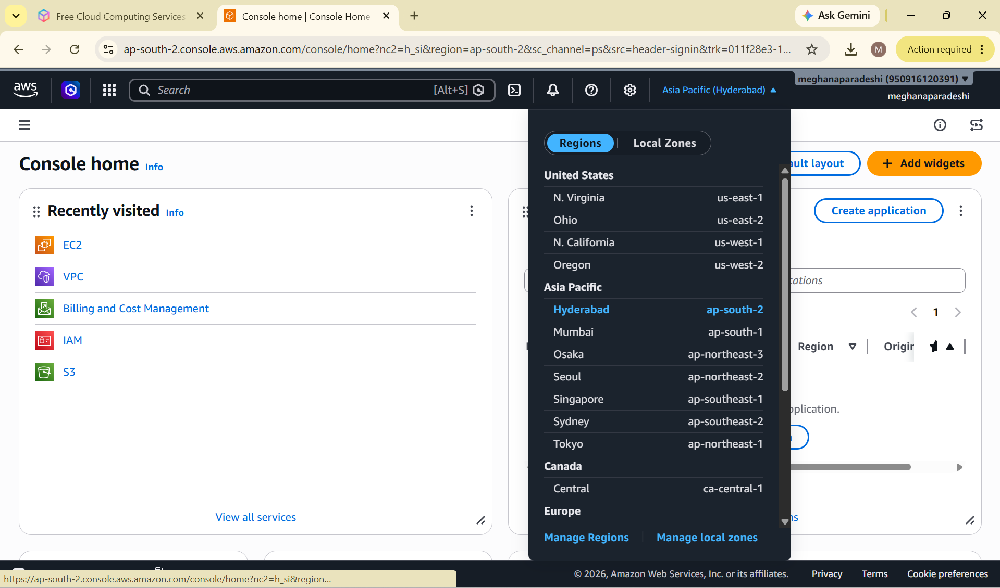

## 2. Lambda Function Created

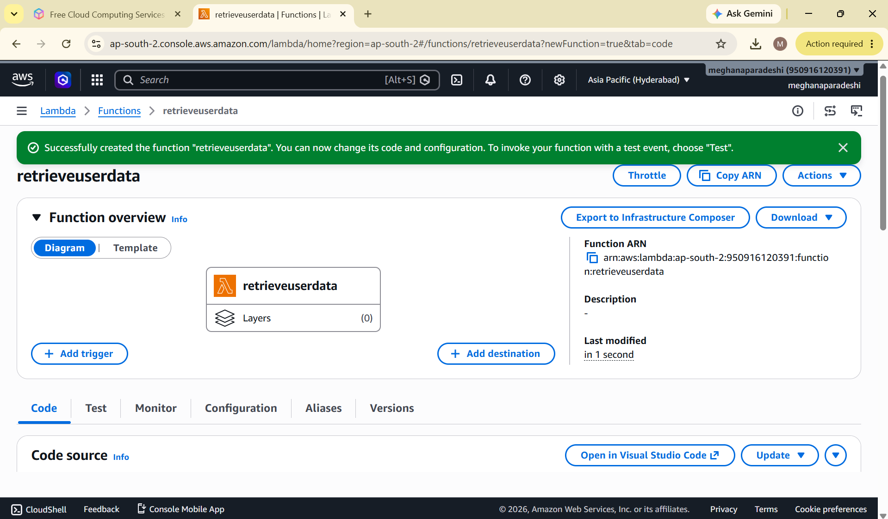

## 3. Lambda Code Added

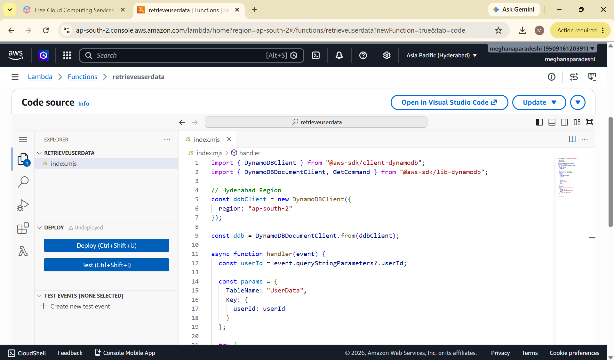

## 4. API Gateway Created

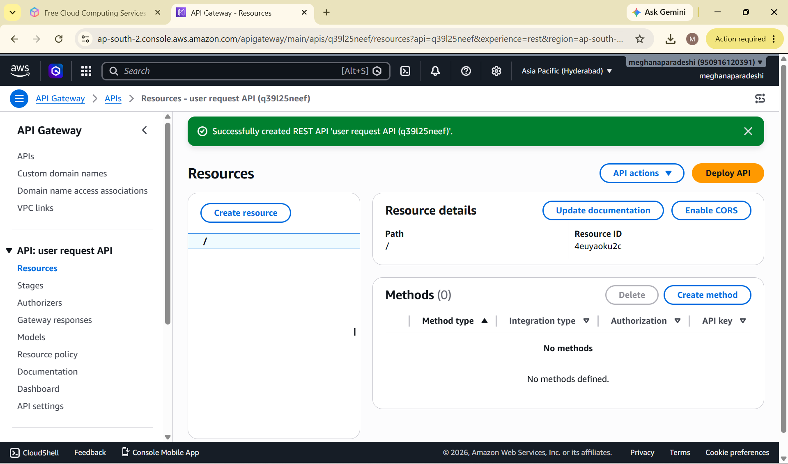

## 5. Resource Created

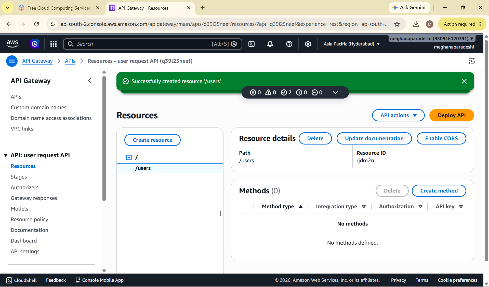

## 6. GET Method Created

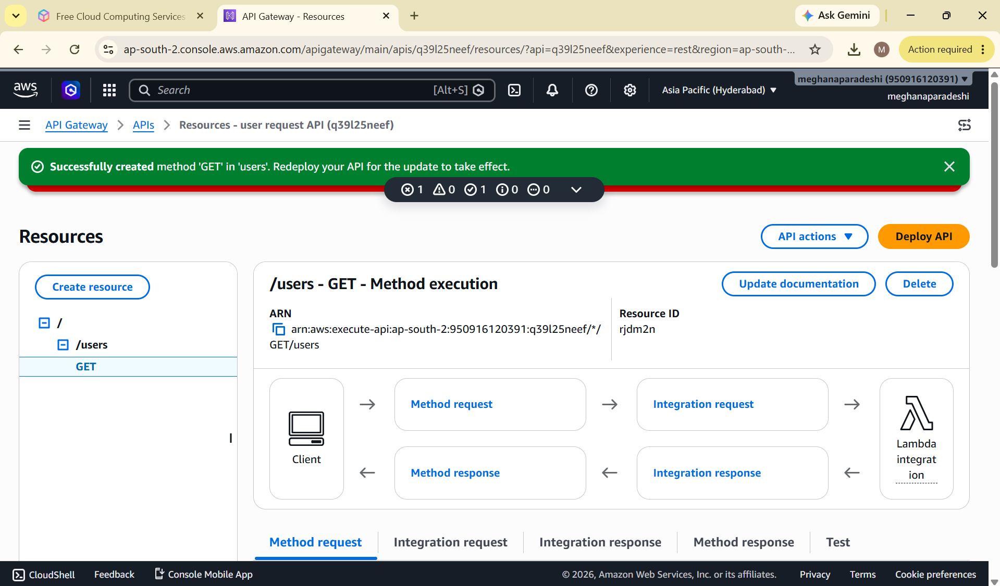

## 7. API URL Generated

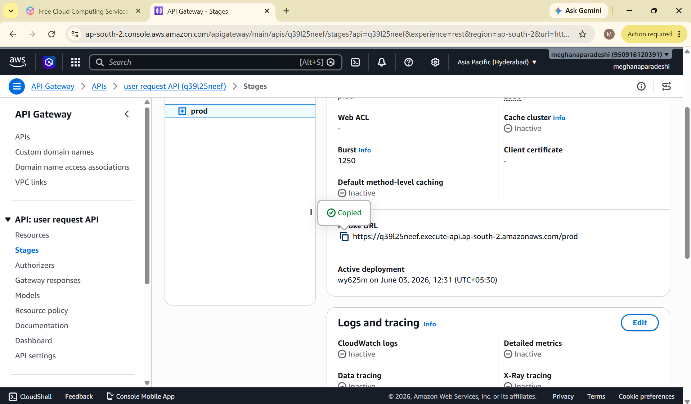

## 8. API Deployed Stage Created

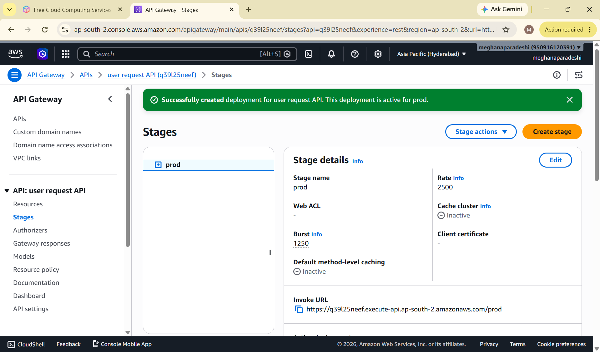

## 9. Missing Authentication Token Error

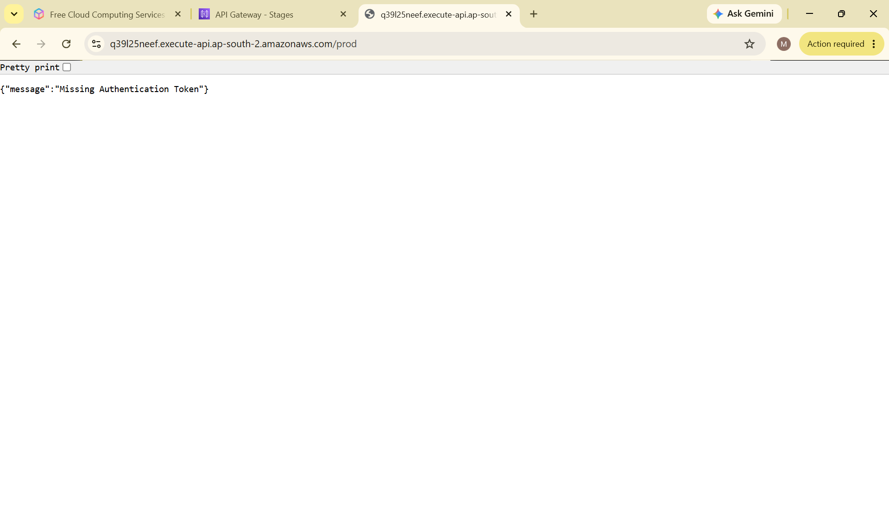

## 10. Documentation Part Created

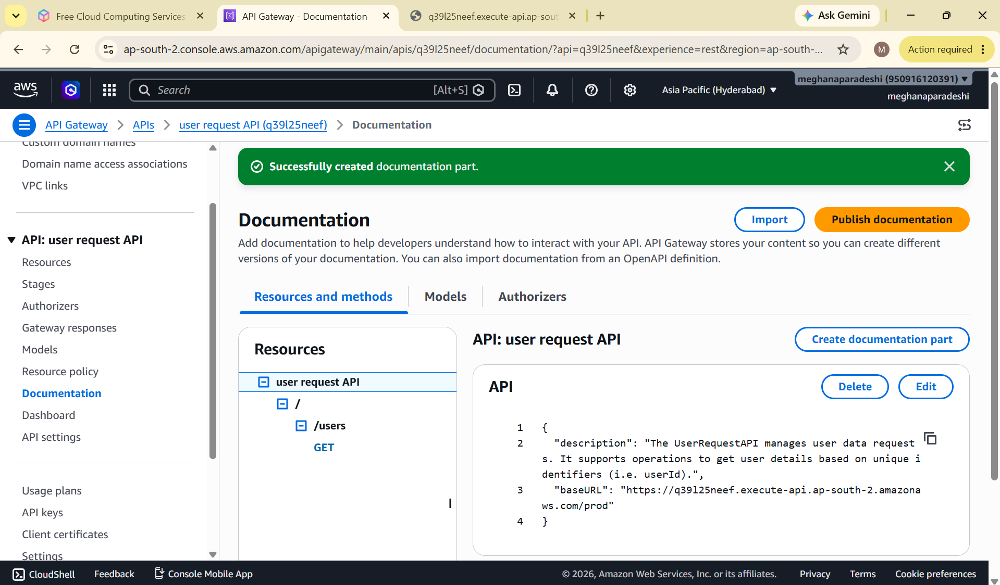

## 11. Documentation Published

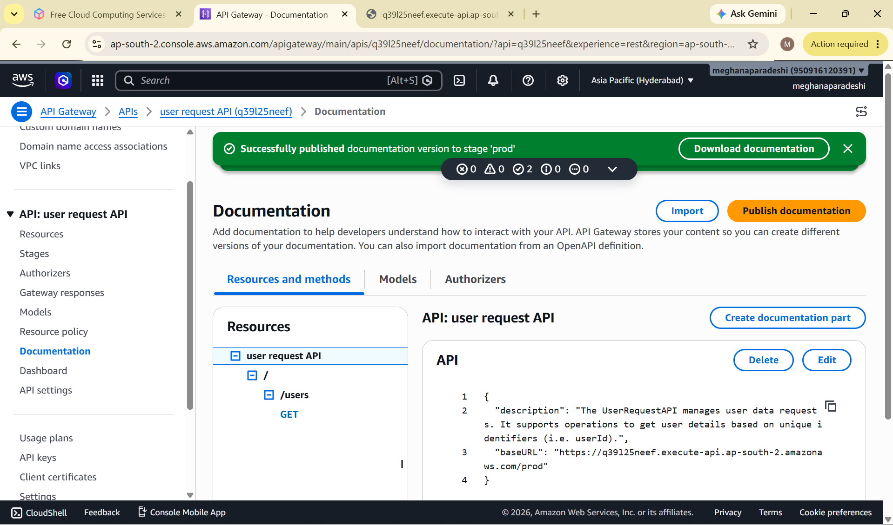

## 12. API Exported

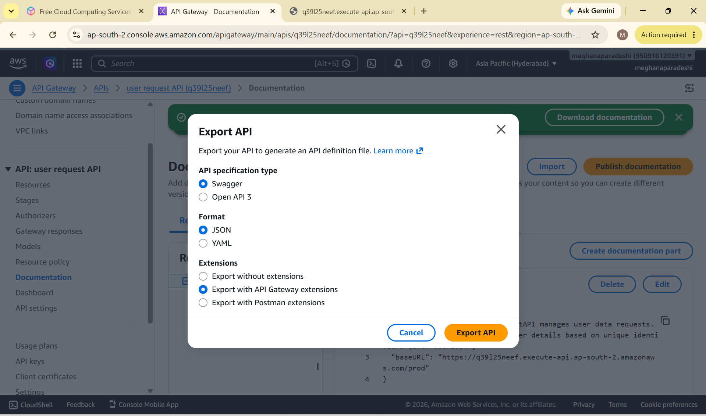

## 13. OpenAPI ZIP Downloaded

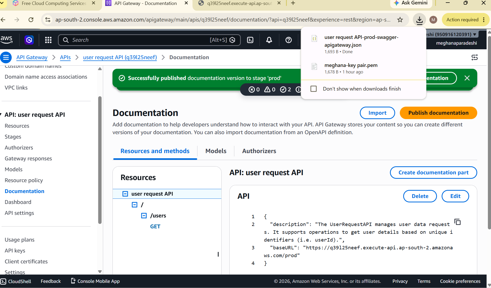

## 14. Project Completed

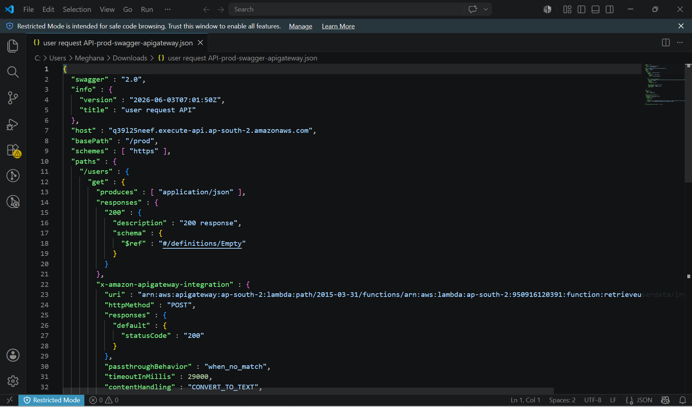

---

## 🐞 Challenge Faced

### Missing Authentication Token Error

#### Issue

The API endpoint returned a "Missing Authentication Token" error when accessed.

#### Possible Causes

* Incorrect URL
* Missing Resource Path
* Incorrect HTTP Method
* API Not Deployed Properly

#### Resolution

* Verified API Resource
* Verified GET Method
* Deployed API to Stage
* Used Correct Endpoint URL

---

## 📚 What is AWS Lambda?

AWS Lambda is a serverless compute service that allows developers to run code without provisioning or managing servers.

---

## 📚 What is Amazon API Gateway?

Amazon API Gateway is a fully managed service used to create, publish, maintain, monitor, and secure APIs at any scale.

---

## 🎓 Learning Outcomes

* Serverless Computing
* AWS Lambda
* API Gateway
* REST APIs
* API Deployment
* API Documentation
* OpenAPI Export
* Cloud-Based API Management

---

## 🔮 Future Enhancements

* Add POST Method
* Add DynamoDB Integration
* Add Authentication
* Implement Multiple API Resources
* Integrate CloudWatch Monitoring

---

## 📝 Note

All AWS resources created during this project were deleted after successful testing to avoid unnecessary AWS charges and follow cloud cost-management best practices.

---

## 👩‍💻 Author

**Meghana Paradeshi**

Aspiring Cloud Engineer

GitHub: https://github.com/meghana1125-ui

---

## ⭐ Support

If you found this project useful, consider giving it a ⭐ on GitHub.
